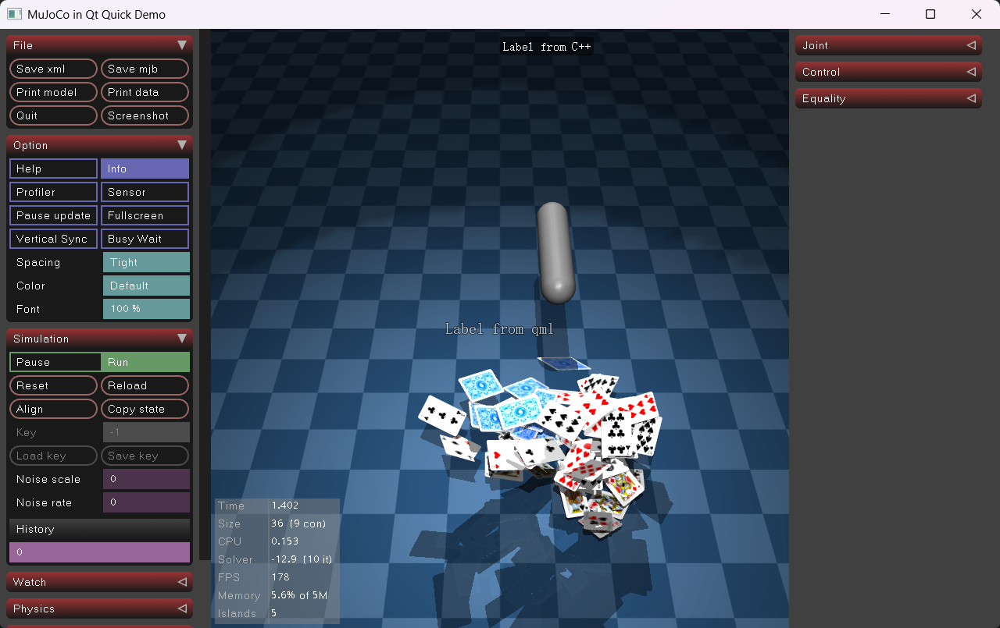

# QMuJoCoSim

**English** | [中文](README.zh-CN.md)


A library that embeds the official [MuJoCo](https://github.com/google-deepmind/mujoco) [`Simulate`](https://github.com/google-deepmind/mujoco/tree/main/simulate) viewer as a QML component inside a Qt Quick application. No GLFW required — full MuJoCo physics simulation and interactive 3D rendering run directly within the QML scene.

## Preview



## Features

- **Zero GLFW dependency**: `QtPlatformUIAdapter` replaces the official `GlfwAdapter`; all OpenGL context management and event handling are driven by Qt.
- **Native QML component**: `MujocoView` inherits `QQuickFramebufferObject` and composes seamlessly with any QML layout, anchors, or animations.
- **Cross-context shared texture**: The MuJoCo render thread owns a private `QOffscreenSurface` + `QOpenGLContext`. The rendered frame is delivered to the Qt Quick scene graph as a shared GL texture via `Qt::AA_ShareOpenGLContexts` — no CPU pixel readback.
- **Frame-paced synchronisation**: The MuJoCo render thread waits for the Qt Quick scene graph to consume each frame before entering the next `mjr_render`, preventing GPU-speed frame generation that would otherwise be discarded and keeping interaction smooth on large windows.
- **Three-thread architecture**: The render thread, physics simulation thread, and Qt main thread each have a dedicated role and never block one another.
- **Drag-and-drop model loading**: Drop a `.xml` or `.mjb` file directly onto the window to hot-swap the model.
- **Discrete GPU preference**: Exports `NvOptimusEnablement` / `AmdPowerXpressRequestHighPerformance` symbols so the driver automatically selects the discrete GPU on dual-GPU laptops.
- **Object trajectory visualisation**: [`addTrajectory`](https://github.com/G-Yong/QMuJoCoSim/blob/master/src/MujocoQuickItem.h#L171) and [`setTrajectoryTrackedSite`](https://github.com/G-Yong/QMuJoCoSim/blob/master/src/MujocoQuickItem.h#L200) APIs let users create and manage trajectory objects from QML, providing real-time visualisation of body motion paths (dynamically updated each frame).

## Architecture

```
Qt Main Thread
└── MujocoView (QQuickFramebufferObject / QML component)
        │  Mouse / Keyboard / Wheel events → PostXxx() → event queue
        │
        ├── Render Thread  (QOffscreenSurface + private QOpenGLContext)
        │       └── mujoco::Simulate::RenderLoop()
        │               └── mjr_render → con_.offFBO (multisample)
        │               └── SwapBuffers: blit → shared GL texture → glFlush
        │               └── Wait for scene graph consume signal (frame pace)
        │
        ├── Physics Thread
        │       └── mj_step / mj_forward loop
        │
        └── Qt Quick Scene Graph Render Thread
                └── MujocoFboRenderer::render()
                        └── Blit shared texture into Quick FBO → emit consume signal
```

| Class | Responsibility |
|---|---|
| `MujocoQuickItem` | `QQuickFramebufferObject` exposed to QML; manages lifecycle and input-event forwarding |
| `MujocoFboRenderer` | Scene-graph-thread side: blits the shared texture into the FBO provided by Qt Quick |
| `QtPlatformUIAdapter` | Implements `mujoco::PlatformUIAdapter`: offscreen FBO management, shared texture creation, frame-pace condition variable, event queue |

`MujocoQuickItem.h` is the public header intended for external consumers. It only includes Qt / C++ standard library headers and `simulationtypes.h`; it never includes MuJoCo or `simulate` headers. Advanced callback interfaces that require `mjModel` / `mjData` use only forward-declared types in the header. `QtPlatformUIAdapter.h`, `simulate.h`, and `mujoco.h` are confined to implementation files or internal adapter headers.

When integrated into the `RobotSimulator` shared library, the build system exports `MujocoQuickItem` via `MUJOCOQUICKITEM_EXPORT=Q_DECL_EXPORT`. The delivery header `simulationview.h` remaps `MUJOCOQUICKITEM_EXPORT` to `ROBOTSIMULATOR_EXPORT` before including `MujocoQuickItem.h`, so consumers can continue using the compatible `RobotSim::SimulationView` type name — which is now a plain alias for `MujocoQuickItem` with no forwarding wrapper.

### Key Design Decisions

| Problem | Solution |
|---|---|
| `con_.offColor_r` is a renderbuffer — it cannot be shared across contexts or sampled as a texture | The adapter creates its own `GL_TEXTURE_2D` + companion FBO; during `SwapBuffers` the multisample offFBO is resolved (blit) into that texture |
| `QOpenGLContext` / `QOffscreenSurface` lose thread affinity when the render thread exits | The render thread calls `moveToThread(nullptr)` before exiting; the main thread's `stop()` calls `moveToThread(currentThread())` and then deletes the objects |
| Rotation / panning stutter on large windows | A `condition_variable` frame pace ties the `mjr` loop rate to the monitor refresh rate |

## Dependencies

| Component | Version |
|---|---|
| Qt | 5.15.2 (requires `quick` and `opengl` modules) |
| MuJoCo | 3.8.0 Windows x86_64 |
| Compiler | MSVC 2019 64-bit (`/utf-8`) |
| OpenGL | 3.3 Compatibility Profile |

## Quick Start

**1. Clone and set the model path**

In `demo/main.cpp`, change `initialXmlPath` to point to your own model:

```cpp
engine.rootContext()->setContextProperty(
    "initialXmlPath",
    QStringLiteral("path/to/your/model.xml"));
```

**2. Open in Qt Creator**

Open `demo/demo.pro`, select the `Desktop Qt 5.15.2 MSVC2019 64bit` kit, and build.

**3. Dual-GPU laptops**

`main.cpp` already exports `NvOptimusEnablement` and `AmdPowerXpressRequestHighPerformance`. NVIDIA / AMD drivers will automatically route the process to the discrete GPU.

Copy this snippet to the top of your own project's `main.cpp` (must be in the main executable — ineffective inside static libraries or DLLs):

```cpp
#if defined(_WIN32)
extern "C" {
    __declspec(dllexport) unsigned long NvOptimusEnablement = 0x00000001;
    __declspec(dllexport) int AmdPowerXpressRequestHighPerformance = 1;
}
#endif
```

## Using in Your Own Project

**C++ side** — include in your `.pro` file and register the QML type in `main()`:

```qmake
include(path/to/src/qmujocosim.pri)
```

```cpp
// main.cpp
QGuiApplication::setAttribute(Qt::AA_UseDesktopOpenGL);
QGuiApplication::setAttribute(Qt::AA_ShareOpenGLContexts); // required

qmlRegisterType<MujocoQuickItem>("QMuJoCoSim", 1, 0, "MujocoView");
```

**QML side**:

```qml
import QMuJoCoSim 1.0

MujocoView {
    anchors.fill: parent
    focus: true

    Component.onCompleted: start("path/to/model.xml")
}
```

**Hot-swap model from C++** (thread-safe):

```cpp
mujocoViewItem->loadScene("new_model.xml");
```

**Via the RobotSimulator delivery library**:

```cpp
#include "robotSimulator.h"

RobotSim::SimulationController controller;
RobotSim::SimulationView *view = controller.simulationView();

view->setSimulationRunning(false);
view->loadScene("robot.mjb");
```

`RobotSim::SimulationView` is a compatibility alias; all properties, signals, and `Q_INVOKABLE` methods come from `MujocoQuickItem` itself. Views created by `SimulationController` disable the left and right MuJoCo built-in UI panels by default. Directly instantiating `MujocoQuickItem` preserves the QMuJoCoSim demo's default UI behaviour.

**QML drag-and-drop**: The `DropArea` example in the demo can be reused directly — drag a `.xml` or `.mjb` file onto the window to switch models.

## Model Library

MuJoCo ships an extensive set of example models. Browse them at the [MuJoCo Model Zoo](https://mujoco.readthedocs.io/en/stable/models.html).

---

## Patches to MuJoCo Vendored Sources

> When upgrading to a new `mujoco-*-windows-x86_64` release, re-apply the changes listed below to the corresponding files in the new version.

### Background

The `PAUSE / LOADING...` overlay near the top-centre of the viewport is drawn by
`simulate.cc::Simulate::Render()` via a direct `mjr_overlay(mjFONT_BIG, mjGRID_TOP, ...)` call
into the offscreen FBO — it cannot be intercepted at the wrapper level.
To work around this, a `status_overlay` toggle and a `status_overlay_text` read-only buffer
were added to `Simulate`, then exposed to QML through the
`MujocoQuickItem::statusOverlayVisible` / `statusOverlayText` properties.

[See `patches/status-overlay.patch`](patches/status-overlay.patch) — 4 change sites in total.

### Upgrade Steps

1. Place the new `mujoco-X.Y.Z-windows-x86_64/` directory alongside this repository and update `MUJOCO_DIR` in `src/qmujocosim.pri`.
2. Inside the new `simulate/` directory, run:
   ```bash
   git apply --directory=mujoco-X.Y.Z-windows-x86_64 patches/status-overlay.patch
   ```
   If the patch cannot be applied automatically due to context drift, merge manually. There are **4 change sites**:
   - `simulate.h`: add the `status_overlay` field below `pause_update`; add the `status_overlay_text` field below `load_error`.
   - `simulate.cc`: add `UpdateStatusOverlayText()` after `zoom_increment`; call it at the start of `Render()`; gate both overlay-drawing calls behind the `status_overlay` toggle.